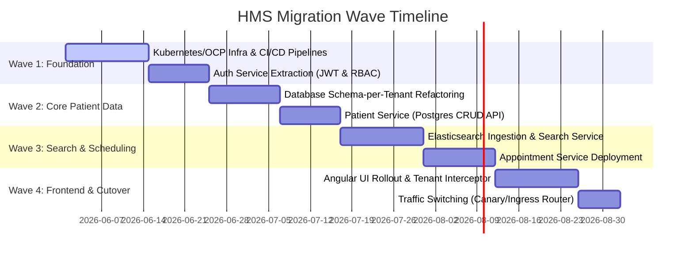

# Legacy Monolith to Cloud-Native Microservices: Migration & Assessment Report

**Target Platform:** Red Hat OpenShift Container Platform (OCP) / Google Kubernetes Engine (GKE)
**Author:** Lead Cloud Migration Architect

---

## 1. Executive Summary & Context
This report documents the intake assessment, discovery, and dependency mapping for migrating a legacy, on-premises **Healthcare Management System (HMS)** to a modern, multi-tenant cloud-native microservices architecture on GKE/OCP. 

### Legacy Architecture Overview (On-Premises):
*   **Application Container:** WebSphere Application Server (WAS) v8.5 running Java EE 6 (EJB 3.0, SOAP Web Services).
*   **Database:** Oracle Database 12c (Single massive instance with shared tables, no tenant isolation).
*   **Deployment:** Bare-metal virtualized servers, managed via manual scripting and configuration drift.
*   **Pain Points:** 
    *   Slow release cycles (monolithic deployment).
    *   No tenant isolation (data leaks across medical clinic clients).
    *   Fuzzy name search on patients is extremely slow, locking DB tables.
    *   Vertical scaling limits hit during peak appointment scheduling hours.

---

## 2. Discovery & Inventory (Application Metadata)

We conducted a static and runtime analysis of the legacy J2EE codebase using IBM Cloud Transformation Advisor and AWS App2Container.

| Metadata Category | Legacy System Metric / Value |
| :--- | :--- |
| **Loc (Lines of Code)** | ~180,000 LOC |
| **Java Version** | JDK 1.7 (Java EE 6) |
| **Application Packaging**| Enterprise Archive (`.ear`) containing multiple Web Archives (`.war`) and EJB modules (`.jar`) |
| **Database Size** | ~1.5 TB Oracle DB |
| **Integrations** | SOAP Web Services, raw JMS queues (ActiveMQ on-premise) |
| **External Dependencies**| Proprietary IBM WAS libraries, Oracle JDBC drivers |

---

## 3. Dependency Mapping (Code & Runtime)

Analysis of the `.ear` package revealed tight architectural coupling. The diagram below maps out the discovered dependencies and the target microservice boundaries:

```mermaid
graph TD
    subgraph Legacy Monolith (.ear)
        AuthModule[User Security & Roles] --- PatientCRUD[Patient Management]
        PatientCRUD --- MedicalRec[Medical Records]
        PatientCRUD --- ApptSched[Appointment Scheduling]
        BillingModule[Patient Billing & Claims] --- ApptSched
    end

    subgraph Proposed Target Microservices
        AuthSvc[Auth Service]
        PatientSvc[Patient Service]
        SearchSvc[Search Service - Elasticsearch]
        ApptSvc[Appointment Service]
    end

    classDef legacy fill:#f9d5e5,stroke:#333,stroke-width:2px;
    classDef target fill:#d4edd9,stroke:#333,stroke-width:2px;
    class AuthModule,PatientCRUD,MedicalRec,ApptSched,BillingModule legacy;
    class AuthSvc,PatientSvc,SearchSvc,ApptSvc target;
```

### Decoupling Strategy (Monolith to Microservices):
1.  **Shared Authentication**: Extract legacy WAS JAAS (Java Authentication and Authorization Service) configurations and replace with stateless **JWT Auth & Spring Security**, run in a standalone `auth-service`.
2.  **Database Decoupling (Database-per-Service)**: Oracle DB tables must be partitioned. Data concerning Patient registration goes to the `patient-service` PostgreSQL database.
3.  **Tenant Isolation**: Legacy shared tables are migrated to **schema-per-tenant** isolation in a PostgreSQL instance to ensure strict HIPAA compliance and multi-tenant isolation.
4.  **CQRS for Patient Search**: Extract fuzzy search operations from the transactional database and move them to an index-based **Elasticsearch** instance (`search-service`).

---

## 4. Migration Waves & Execution Strategy

We will apply the **Strangler Fig Pattern** to systematically migrate services out of the monolith without downtime.



### Wave 1: Foundation (Cloud Readiness)
*   **Objective**: Set up Kubernetes/Red Hat OCP namespaces, network policies, and configure GitHub Actions pipelines.
*   **Deliverables**: Ingress controllers, Kubernetes namespaces (`hms-prod`, `hms-dev`), base Secret/ConfigMap schemas, and the extraction of the security layer into a JWT-based `auth-service`.

### Wave 2: Patient Data Modernization
*   **Objective**: Extract Patient and Medical Record data from Oracle DB. 
*   **Data Migration**: Map legacy `PATIENT_INFO` tables into tenant-segregated Postgres schemas (`tenant_a`, `tenant_b`). Set up **Liquibase/Flyway** for database schema migrations.
*   **API Exposure**: Deploy the containerized `patient-service` to write/read to PostgreSQL.

### Wave 3: Elasticsearch Integration & Search Extraction
*   **Objective**: Solve the legacy database locking issue during customer fuzzy search queries.
*   **Execution**: Build a `search-service` using Spring Data Elasticsearch. Run a background sync worker that listens to update events from `patient-service` and indexes them in Elasticsearch.

### Wave 4: Frontend Rollout & Decommissioning
*   **Objective**: Replace the legacy JSF/JSP web frontend with a single Angular 17 client.
*   **Execution**: Deploy the Angular client. Configure the API Gateway to route 100% of traffic to the new services and sunset the legacy WAS monolith.

---

## 5. Security & Exposing APIs on Kubernetes/GKE

To secure application interfaces for cloud deployment, we will design the ingress topology as follows:

1.  **Ingress Controller**: Acts as the Edge Router, terminating SSL/TLS and routing external traffic to the API Gateway.
2.  **API Gateway**: Implemented using Spring Cloud Gateway. It:
    *   Exposes endpoints to the public internet (TLS terminated).
    *   Authenticates incoming JWTs by calling the `auth-service`.
    *   Injects the `X-TenantID` header based on the JWT claims before routing request downstream inside the private Kubernetes cluster network.
3.  **Network Policies**: Restrict database access. Only the `patient-service` pod is permitted to communicate with the PostgreSQL pod. Only `search-service` is allowed to communicate with Elasticsearch.
